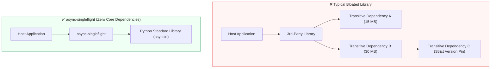

# Frequently Asked Questions & Architectural Decisions 📐

This document outlines key technical decisions, architectural trade-offs, and common interview questions regarding the design of `async-singleflight`.

---

## Q1: Why does `async-singleflight` have zero external core dependencies?

> **Summary:** The core library relies strictly on Python's built-in standard library (`asyncio`, `dataclasses`, `inspect`). It introduces zero third-party packages into production environments.

### 1. Eliminating "External Bloat" and Dependency Hell

When an application installs an external library, it frequently pulls in dozens of secondary ("transitive") dependencies. This creates significant production hazards:



* **Version Collisions:** If your library pins `pydantic>=2.0` but an enterprise service relies on `pydantic<2.0`, installing the library triggers an immediate dependency conflict, preventing adoption entirely.
* **Container Weight & Cold Starts:** In serverless (AWS Lambda, Google Cloud Run) and Kubernetes clusters, large dependency trees inflate Docker image sizes and slow down pod scaling times.
* **Guaranteed Compatibility:** Because `async-singleflight` relies only on Python standard primitives, it can be dropped into **any** existing Python 3.11+ application without breaking existing requirements.

---

### 2. Mitigating Supply-Chain Vulnerabilities (Enterprise Security)

Enterprise security teams (especially in banking, healthcare, and infrastructure) audit every package introduced into production systems.

```
Attack Surface = (Direct Dependencies) + (Transitive Dependencies)
```

* **What is a Supply-Chain Risk?** When you import external libraries, you implicitly trust every developer who contributes to every package in that dependency tree. If an account is hijacked or a malicious maintainer injects code (e.g., the *XZ Utils* backdoor or *event-stream* incident), your application is exposed.
* **Automated Security Scanners (Snyk, Dependabot, SonarQube):** Security scanners continuously flag CVEs (Common Vulnerabilities and Exposures). Libraries with heavy dependency trees generate constant security alerts and require frequent emergency patching.
* **Instant Enterprise Approval:** With `dependencies = []`, `async-singleflight` introduces **zero third-party code**. Enterprise security review boards can approve its use immediately without lengthy compliance cycles.

---

### 3. Comparison Matrix

| Factor | Heavy Dependency Architecture | `async-singleflight` Standard |
| :--- | :--- | :--- |
| **Download Size** | 20–80 MB+ | **< 20 KB** |
| **Transitive CVE Risks** | High (5–30 upstream packages) | **Zero (Standard library only)** |
| **Version Conflict Risk** | High (frequent breakage) | **None** |
| **Docker Build Impact** | Slower container builds | **Instantaneous** |
| **Enterprise Audit** | Weeks of security clearance | **Immediate green light** |

---

### 💡 Interview Defense Guide

If an interviewer or senior engineer asks:
> *"Why did you choose not to use any third-party concurrency libraries for the core singleflight engine?"*

**Recommended Answer:**
> *"We intentionally set `dependencies = []` in our core configuration. Request coalescing is fundamentally an in-process synchronization pattern, and Python's native `asyncio` standard library already provides all the necessary primitives (`Future`, `Lock`, `shield`).*
> 
> *By eliminating third-party dependencies, we achieve three critical production benefits: zero package bloat, zero version collisions with existing host applications, and zero supply-chain security vulnerabilities."*
